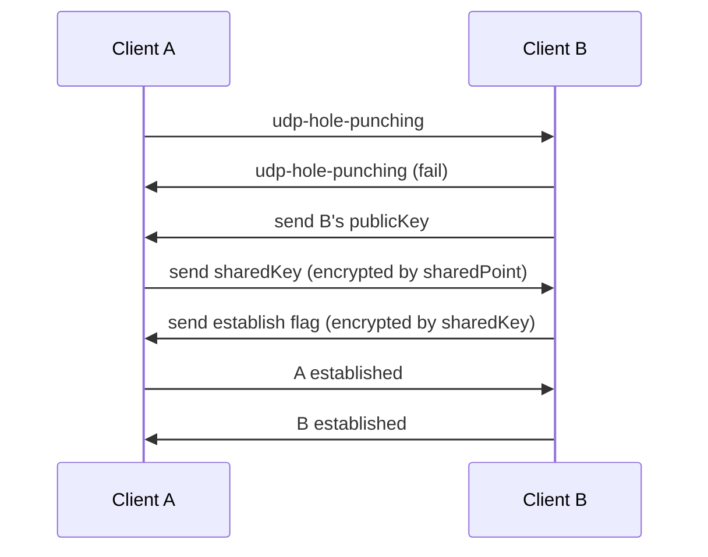

Secure Reliable Multi UDP
====

building on the awesome https://github.com/namuyan/srudp this is an extension to allow **Secure Reliable Data Stream(s)** that works like TCP.
Purpose is to enable users to create P2P connections between clients in closed NAT.

Rendezvous data can either be passed manually or exchanged via the Autonomi Network. 
    (Then pointers to the Communication partners need to be passed instead of cleartext IP:PORT combinations. Communication partners then can update their connection info when they go online and get available for connections. Since this data can be polled/discovered on a trigger this enables fully decentralized p2p communication even without any centralized servers involved for peer discovery.)

Features
----
* Protocol similar to RUDP
* UDP hole punching
* ipv4/ipv6
* optional asyncio

#### Communication Flow:



planned Features (/ideas to investigate)
----

- gossip protocol on massive-multi-user connections? (not because of the traffic but because of the connection count)

- explicit data-routing through other participant; signature based "connect via" if for some reason not everyone can connect to everyone but "everyone is connected to someone"
    - possibility to add a "gate" to a chat/user. The Gate is port-forwarded/an exposed host/port and doesn't require hole-punching. It can be attached to a chat/might come with a participant and users try to hole-punch as default communication route. If that connection doesn't work sending to others via the gate is the fallback communication option. (combined with the "connect via" -> a user having a Gate entering a multi-user-chat allows everyone to talk to everyone else even if hole-punch would fail for all other participants [as long as outgoing connections to the gate don't get blocked])
- protocol-relay-connection - for scenarios where even outgoing udp is being blocked
    - connecting to it via websocket (?) because that's probably possible even in restricted environments
      - creating a JS client for this
      - creating a python client for this
    - dockerizing that relay-server
    - if a Gate supports protocol-relay then this would enable "connect via" even from difficult network scenarios (so that one friend in the airport hotspot can talk to everyone else via the Gate another group member happens to have/run and that got cached as possible gate to the group)


Installation
----
[tutorial for users "cannot work on my condition"](TUTORIAL.md)
```bash
poetry add srmudp
```

Tests
----
```commandline
cd srmudp
poetry install
poetry run python -m mypy --config-file=mypy.ini srmudp
poetry run python -m unittest discover
```

if you encounter trouble connecting
----
* UDP (and some TCP) is often **blocked** on public network
like airport free wifi and university local LAN etc.
Additional some router and network adapter block it too.
* I designed this simple building block for decentralized communication for environments where users don't have specialized knowledge/access to port-forwarding but where udp traffic isn't actively blocked either.
This library doesn't emit special signals or comes with specialized data structures because I will use it as a low-layer library for P2P communication.

Note: Why make this?
----
These days, PCs are usually located in local environment protected by NAT.
It is difficult to transfer data between two parties without special port-forwarding rules being set up on the router.
In order to solve this problem, connection is realized by **UDP hole punching** without the use of UPnP.

UDP is a socket protocol without any handshakes and reliability guarantees.
Therefore, there is no connection state, data may be lost,
spoofing the source is easy. This is why, you cannot simply use it the same way as TCP.
With this library, you can treat the connection just like a TCP connection without worrying about the above issues.
In other words, it has a connection state, guarantees data to be delivered (if connected), and is the source is difficult to forge due to cryptography.

Links
----
* [initial implementation of the systematic for 1:1 p2p connection that is adapted here for multi-endpoint connections and serverless peer discovery](https://github.com/namuyan/srudp)

Licence
----
MIT